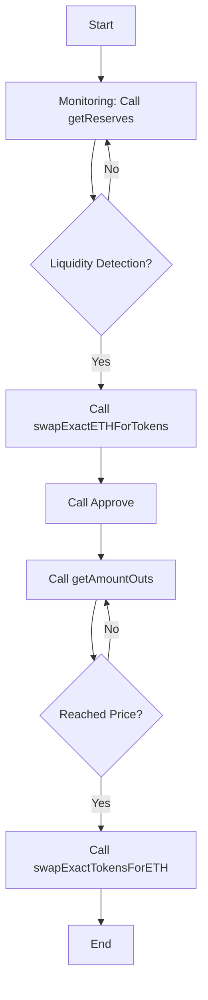

# UniswapV2-Sniper

https://www.youtube.com/watch?v=NU0HtzAC6-o

## Workflow

```mermaid
graph TD
    A[Start] --> B[Monitoring: Call getReserves]
    B --> C{Liquidity Detection?}
    C -->|Yes| D[Call swapExactETHForTokens]
    C -->|No| B
    D --> E[Call Approve]
    E --> F[Call getAmountOuts]
    F --> G{Reached Price?}
    G -->|No| F
    G -->|Yes| H[Call swapExactTokensForETH]
    H --> I[End]
```
